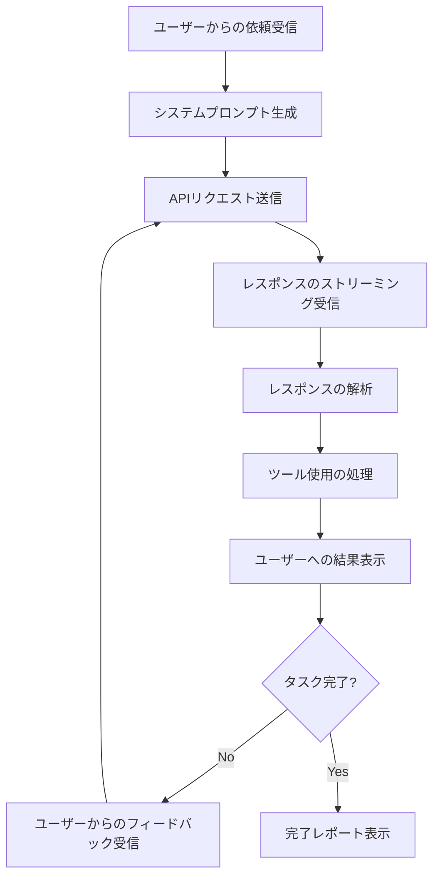
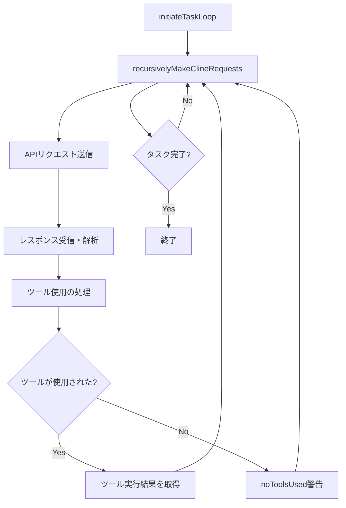
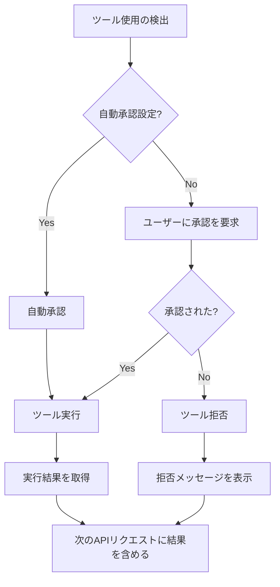

# CoolClineのコード作成処理フロー詳細

このドキュメントでは、ユーザーからプログラムコードの作成依頼を受けた場合のCoolClineの処理フローを詳細に説明します。

## 1. 処理フローの概要

CoolClineがコード作成依頼を受けてから完了するまでの基本的な処理フローは以下の通りです：



## 2. システムプロンプトからAPIリクエストへの変換

### 2.1 システムプロンプトの構成

システムプロンプトは`cline/src/core/prompts/system.ts`で定義されており、以下の要素で構成されています：

- CoolClineの基本的な役割と能力の説明
- ツールの使用方法と形式の説明
- 各ツール（execute_command, read_file, write_to_file など）の詳細な説明
- ツール使用のガイドラインとベストプラクティス
- 環境情報（OS、シェル、ホームディレクトリなど）
- 目標と作業方法の説明

### 2.2 APIリクエストの構築

`Cline.ts`の`recursivelyMakeClineRequests`メソッドがAPIリクエストを構築します：

1. ユーザーの入力（タスク説明）を受け取る
2. 環境情報を収集（`getEnvironmentDetails`メソッド）
   - VSCodeの可視ファイル
   - 開いているタブ
   - アクティブなターミナル
   - 現在の時刻
   - 作業ディレクトリのファイル一覧
3. システムプロンプトを生成（`SYSTEM_PROMPT`関数）
4. ユーザーのカスタム指示があれば追加（`addUserInstructions`関数）
5. 会話履歴を取得し、必要に応じて切り捨て（`getTruncatedMessages`関数）
6. APIリクエストを構築して送信（`attemptApiRequest`メソッド）

## 3. ループ処理の仕組み

CoolClineは再帰的なループ処理を使用して、タスクを完了するまで対話を続けます：

### 3.1 基本的なループ構造



### 3.2 具体的なループ処理

1. `initiateTaskLoop`メソッドがタスクのメインループを開始
2. `recursivelyMakeClineRequests`メソッドがAPIリクエストを送信
3. レスポンスをストリーミングで受信し、`parseAssistantMessage`関数で解析
4. `presentAssistantMessage`メソッドがレスポンスを処理し、ツール使用があれば実行
5. ツール実行結果を次のAPIリクエストに含める
6. タスクが完了するまで（`attempt_completion`ツールが使用されるまで）このループを繰り返す

## 4. API実行で使用されるプロンプト

### 4.1 プロンプトの構造

APIに送信されるプロンプトは以下の構造になっています：

```
[システムプロンプト]
====
[ツール使用の説明]
[ツールのリスト]
[ツール使用のガイドライン]
====
[ユーザーのカスタム指示]
====
[システム情報]
====
[目標]

[会話履歴]
ユーザー: [タスク説明]
アシスタント: [前回の応答]
ユーザー: [ツール実行結果]
...

[環境情報]
```

### 4.2 プロンプト生成の具体的な処理

1. `SYSTEM_PROMPT`関数がベースとなるシステムプロンプトを生成
2. `addUserInstructions`関数がユーザーのカスタム指示を追加
3. 会話履歴が追加される（`apiConversationHistory`配列）
4. 環境情報が追加される（`getEnvironmentDetails`メソッド）
5. 最終的なプロンプトがAPIに送信される（`createMessage`メソッド）

## 5. レスポンスの処理とツールの実行

### 5.1 レスポンスの解析

1. APIからのレスポンスは`parseAssistantMessage`関数で解析される
2. レスポンスはテキストコンテンツとツール使用に分割される
3. ツール使用は名前とパラメータに分解される

### 5.2 ツールの実行

1. `presentAssistantMessage`メソッドがツール使用を処理
2. ツールの種類に応じて適切なメソッドが呼び出される：
   - `executeCommandTool`: コマンド実行
   - `read_file`: ファイル読み込み
   - `write_to_file`: ファイル書き込み
   - `browser_action`: ブラウザ操作
   - など
3. ツール実行結果がユーザーに表示され、次のAPIリクエストに含められる

### 5.3 ツール実行の承認フロー



## 6. 具体的な処理例：コード作成タスク

ユーザーが「Todoアプリを作成して」と依頼した場合の処理フロー：

1. ユーザーの依頼を受信し、システムプロンプトを生成
2. APIリクエストを送信し、レスポンスを受信
3. レスポンスを解析し、ツール使用（例：`list_files`）を検出
4. ツールを実行し、結果をユーザーに表示
5. ツール実行結果を次のAPIリクエストに含める
6. 新しいレスポンスを受信し、次のツール使用（例：`write_to_file`）を検出
7. ファイル作成ツールを実行し、結果をユーザーに表示
8. このプロセスを繰り返し、必要なファイル（HTML, CSS, JavaScript）を作成
9. 最終的に`attempt_completion`ツールを使用してタスク完了を報告

## 7. システムプロンプトとAPIリクエストの関係

システムプロンプトはCoolClineの基本的な動作を定義し、APIリクエストはその動作に基づいて具体的なタスクを実行します。

### 7.1 システムプロンプトの役割

- CoolClineの基本的な能力と制約を定義
- 利用可能なツールとその使用方法を説明
- ツール使用のガイドラインとベストプラクティスを提供
- 環境情報を提供

### 7.2 APIリクエストの役割

- 具体的なタスクの内容を伝達
- ツール実行結果を含める
- 会話の文脈を維持
- 環境の最新状態を反映

## 8. まとめ

CoolClineのコード作成処理フローは、システムプロンプトの生成、APIリクエストの送信、レスポンスの解析、ツールの実行という一連のステップで構成されています。このプロセスは、タスクが完了するまで再帰的に繰り返されます。

システムプロンプトはCoolClineの基本的な動作を定義し、APIリクエストはその動作に基づいて具体的なタスクを実行します。ツールの使用により、CoolClineはファイルの読み書き、コマンドの実行、ブラウザの操作などの操作を行い、ユーザーの依頼に応じたコードを作成します。

このような再帰的なループ処理と柔軟なツール使用により、CoolClineは複雑なコード作成タスクを効率的に実行することができます。