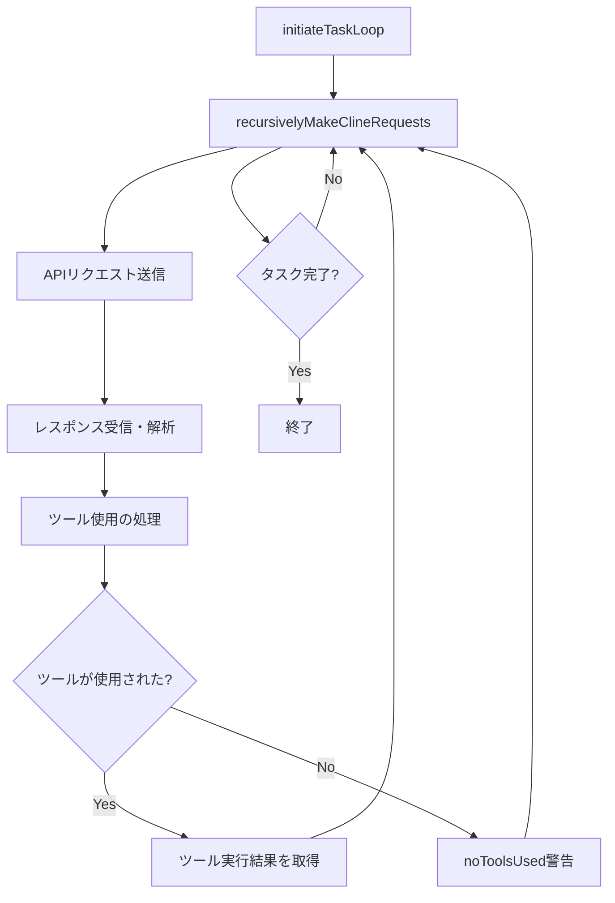
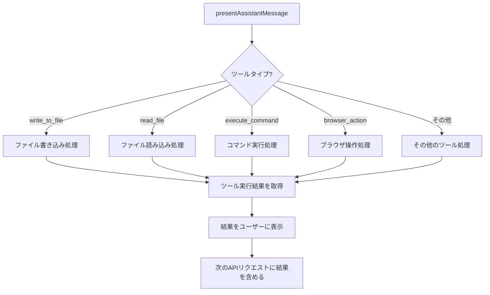
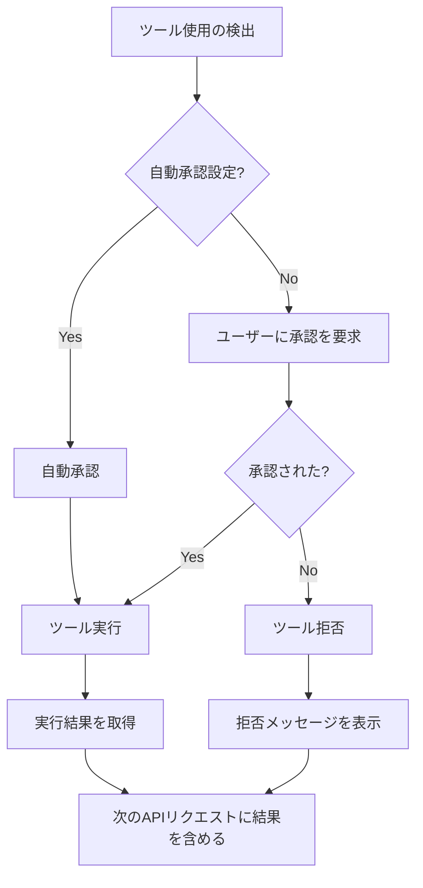

# CoolClineのループ処理とツール実行

このドキュメントでは、CoolClineのループ処理とツール実行の仕組みについて詳細に説明します。

## 1. ループ処理の基本構造

CoolClineのループ処理は、`Cline.ts`ファイルの`initiateTaskLoop`メソッドと`recursivelyMakeClineRequests`メソッドを中心に実装されています。

### 1.1 基本的なループフロー



### 1.2 ループ処理のコード構造

```typescript
// initiateTaskLoop メソッド
private async initiateTaskLoop(userContent: UserContent, isNewTask: boolean): Promise<void> {
    let nextUserContent = userContent;
    let includeFileDetails = true;
    while (!this.abort) {
        const didEndLoop = await this.recursivelyMakeClineRequests(nextUserContent, includeFileDetails, isNewTask);
        includeFileDetails = false; // 最初のリクエストのみファイル詳細を含める

        if (didEndLoop) {
            break;
        } else {
            nextUserContent = [
                {
                    type: "text",
                    text: formatResponse.noToolsUsed(),
                },
            ];
            this.consecutiveMistakeCount++;
        }
    }
}

// recursivelyMakeClineRequests メソッド（簡略化）
async recursivelyMakeClineRequests(userContent: UserContent, includeFileDetails: boolean, isNewTask: boolean): Promise<boolean> {
    // 環境情報の収集
    const [parsedUserContent, environmentDetails] = await this.loadContext(userContent, includeFileDetails);
    
    // APIリクエスト送信
    const stream = this.attemptApiRequest(previousApiReqIndex);
    
    // レスポンス処理
    for await (const chunk of stream) {
        // チャンクの処理
        // アシスタントメッセージの解析
        // ツール使用の検出と実行
    }
    
    // ツール実行結果の処理
    await pWaitFor(() => this.userMessageContentReady);
    
    // 次のリクエストを再帰的に呼び出し
    const recDidEndLoop = await this.recursivelyMakeClineRequests(this.userMessageContent);
    
    return didEndLoop;
}
```

## 2. APIリクエストとレスポンスの処理

### 2.1 APIリクエストの送信

```typescript
// attemptApiRequest メソッド（簡略化）
async *attemptApiRequest(previousApiReqIndex: number): ApiStream {
    // システムプロンプトの生成
    let systemPrompt = await SYSTEM_PROMPT(cwd, supportsComputerUse, mcpHub, this.browserSettings);
    
    // カスタム指示の追加
    if (settingsCustomInstructions || clineRulesFileInstructions || clineIgnoreInstructions || preferredLanguageInstructions) {
        systemPrompt += addUserInstructions(
            settingsCustomInstructions,
            clineRulesFileInstructions,
            clineIgnoreInstructions,
            preferredLanguageInstructions,
        );
    }
    
    // 会話履歴の切り捨て
    const truncatedConversationHistory = getTruncatedMessages(
        this.apiConversationHistory,
        this.conversationHistoryDeletedRange,
    );
    
    // APIリクエスト送信
    let stream = this.api.createMessage(systemPrompt, truncatedConversationHistory);
    
    // ストリームの処理
    yield* stream;
}
```

### 2.2 レスポンスの解析

```typescript
// parseAssistantMessage 関数（簡略化）
export function parseAssistantMessage(assistantMessage: string) {
    let contentBlocks: AssistantMessageContent[] = [];
    let currentTextContent: TextContent | undefined = undefined;
    let currentToolUse: ToolUse | undefined = undefined;
    
    // メッセージを1文字ずつ解析
    for (let i = 0; i < assistantMessage.length; i++) {
        // テキストコンテンツの解析
        // ツール使用の検出
        // ツールパラメータの解析
    }
    
    return contentBlocks;
}
```

## 3. ツール実行の詳細フロー

### 3.1 ツール実行の基本フロー



### 3.2 ツール実行の承認フロー



### 3.3 具体的なツール実行例：write_to_file

```typescript
// write_to_file ツールの処理（簡略化）
case "write_to_file": {
    const relPath: string | undefined = block.params.path;
    const content: string | undefined = block.params.content;
    
    // パラメータの検証
    if (!relPath || !content) {
        break;
    }
    
    // アクセス権の検証
    const accessAllowed = this.clineIgnoreController.validateAccess(relPath);
    if (!accessAllowed) {
        await this.say("clineignore_error", relPath);
        pushToolResult(formatResponse.toolError(formatResponse.clineIgnoreError(relPath)));
        break;
    }
    
    // ファイルの存在確認
    const absolutePath = path.resolve(cwd, relPath);
    const fileExists = await fileExistsAtPath(absolutePath);
    
    // ユーザーに承認を要求
    if (this.shouldAutoApproveTool(block.name)) {
        await this.say("tool", JSON.stringify(sharedMessageProps), undefined, false);
    } else {
        const didApprove = await askApproval("tool", JSON.stringify(sharedMessageProps));
        if (!didApprove) {
            break;
        }
    }
    
    // ファイル書き込み
    await this.diffViewProvider.open(relPath);
    await this.diffViewProvider.update(newContent, true);
    
    // 結果の処理
    const { newProblemsMessage, userEdits, autoFormattingEdits, finalContent } = await this.diffViewProvider.saveChanges();
    
    // チェックポイントの保存
    await this.saveCheckpoint();
    
    break;
}
```

## 4. ループ処理の具体例：Todoアプリ作成

以下は、「シンプルなTodoアプリを作成して」というタスクに対するループ処理の具体例です：

### 4.1 最初のループ

1. ユーザーの依頼を受信：「シンプルなTodoアプリを作成して」
2. システムプロンプトを生成し、APIリクエストを送信
3. レスポンスを受信：「まずは現在のファイル構成を確認します」+ `read_file` ツール使用
4. `read_file` ツールを実行し、結果をユーザーに表示
5. 結果を次のAPIリクエストに含めて送信

### 4.2 2回目のループ

1. 前回のツール実行結果を含むAPIリクエストを送信
2. レスポンスを受信：「Todoアプリの構造を作成します」+ `write_to_file` ツール使用
3. `write_to_file` ツールを実行し、結果をユーザーに表示
4. 結果を次のAPIリクエストに含めて送信

### 4.3 3回目のループ

1. 前回のツール実行結果を含むAPIリクエストを送信
2. レスポンスを受信：「CSSスタイルを追加します」+ `write_to_file` ツール使用
3. `write_to_file` ツールを実行し、結果をユーザーに表示
4. 結果を次のAPIリクエストに含めて送信

### 4.4 4回目のループ

1. 前回のツール実行結果を含むAPIリクエストを送信
2. レスポンスを受信：「JavaScriptの機能を実装します」+ `write_to_file` ツール使用
3. `write_to_file` ツールを実行し、結果をユーザーに表示
4. 結果を次のAPIリクエストに含めて送信

### 4.5 最終ループ

1. 前回のツール実行結果を含むAPIリクエストを送信
2. レスポンスを受信：「Todoアプリが完成しました」+ `attempt_completion` ツール使用
3. `attempt_completion` ツールを実行し、タスク完了を報告
4. ループ終了

## 5. ツール実行の詳細

### 5.1 ツールの種類と処理方法

| ツール名 | 処理内容 | 主なパラメータ |
|---------|---------|--------------|
| read_file | ファイルの読み込み | path |
| write_to_file | ファイルの書き込み | path, content |
| replace_in_file | ファイルの一部置換 | path, diff |
| search_files | ファイル内容の検索 | path, regex, file_pattern |
| list_files | ファイル一覧の取得 | path, recursive |
| execute_command | コマンドの実行 | command, requires_approval |
| browser_action | ブラウザの操作 | action, url, coordinate, text |
| ask_followup_question | ユーザーへの質問 | question |
| attempt_completion | タスク完了の報告 | result, command |

### 5.2 ツール実行結果の形式

```typescript
// ツール実行結果の形式
interface ToolResult {
    type: "text" | "image";
    text?: string;
    image?: string;
}

// ツール実行結果の例
const result = {
    type: "text",
    text: "ファイルが正常に作成されました。\n\nファイル内容：\n```html\n<!DOCTYPE html>\n<html>\n...\n</html>\n```"
};
```

### 5.3 ツール実行のエラーハンドリング

```typescript
// エラーハンドリングの例
try {
    // ツール実行
    await this.diffViewProvider.update(newContent, true);
} catch (error) {
    // エラーメッセージの表示
    await this.say("error", `Error writing file:\n${error.message}`);
    
    // エラー結果の返却
    pushToolResult(formatResponse.toolError(`Error writing file: ${error.message}`));
    
    // クリーンアップ
    await this.diffViewProvider.revertChanges();
    await this.diffViewProvider.reset();
}
```

## 6. ループ処理の最適化と制約

### 6.1 トークン数の管理

```typescript
// トークン数の管理
if (totalTokens >= maxAllowedSize) {
    // 会話履歴の切り捨て
    this.conversationHistoryDeletedRange = getNextTruncationRange(
        this.apiConversationHistory,
        this.conversationHistoryDeletedRange,
        keep,
    );
}
```

### 6.2 自動承認の制限

```typescript
// 自動承認の制限
if (this.autoApprovalSettings.enabled && this.consecutiveAutoApprovedRequestsCount >= this.autoApprovalSettings.maxRequests) {
    // ユーザーに確認を要求
    await this.ask("auto_approval_max_req_reached", `Clineは${this.autoApprovalSettings.maxRequests.toString()}回のAPIリクエストを自動承認しました。カウントをリセットしてタスクを続行しますか？`);
    
    // カウントのリセット
    this.consecutiveAutoApprovedRequestsCount = 0;
}
```

### 6.3 連続エラーの処理

```typescript
// 連続エラーの処理
if (this.consecutiveMistakeCount >= 3) {
    // ユーザーに確認を要求
    const { response, text, images } = await this.ask("mistake_limit_reached", "...");
    
    if (response === "messageResponse") {
        // ユーザーのフィードバックを次のリクエストに含める
        userContent.push(
            {
                type: "text",
                text: formatResponse.tooManyMistakes(text),
            },
            ...formatResponse.imageBlocks(images),
        );
    }
    
    // カウントのリセット
    this.consecutiveMistakeCount = 0;
}
```

## 7. まとめ

CoolClineのループ処理とツール実行の仕組みは、以下の特徴を持っています：

1. **再帰的なループ構造**: `initiateTaskLoop`と`recursivelyMakeClineRequests`メソッドによる再帰的なループ構造
2. **ストリーミングベースの処理**: APIレスポンスをストリーミングで受信し、リアルタイムで解析・処理
3. **ツール使用の検出と実行**: XMLスタイルのタグを解析してツール使用を検出し、適切なメソッドで実行
4. **ユーザー承認フロー**: ツール実行前にユーザーの承認を求める（または自動承認設定に従う）
5. **エラーハンドリング**: ツール実行のエラーを適切に処理し、ユーザーに通知
6. **最適化と制約**: トークン数の管理、自動承認の制限、連続エラーの処理などの最適化と制約

このような仕組みにより、CoolClineはユーザーの依頼に応じて適切なツールを使用し、タスクを効率的に実行することができます。特に、ツール使用の結果を次のAPIリクエストに含めることで、コンテキストを維持しながら複雑なタスクを段階的に実行することが可能になっています。