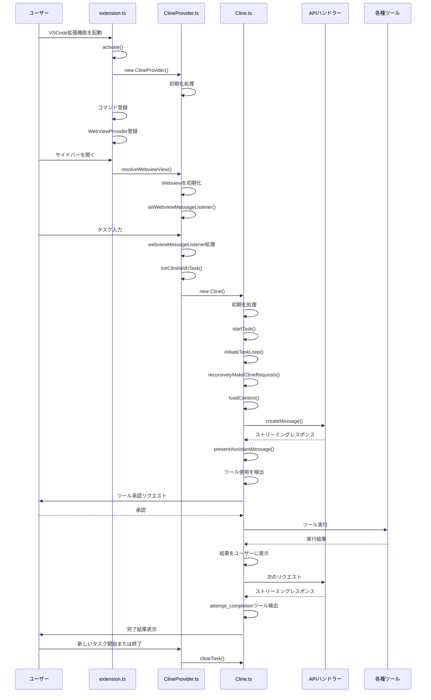

# Clineメイン処理フロー

## 主要コンポーネントの説明

### extension.ts
VSCode拡張機能のエントリーポイント。拡張機能の起動時に実行され、ClineProviderの初期化やコマンド登録を行います。

### ClineProvider.ts
Webviewの管理とユーザーインターフェースの処理を担当します。ユーザーからの入力を受け取り、Clineクラスに処理を委譲します。

### Cline.ts
コア処理ロジックとツール実行を担当します。APIリクエストの送信、レスポンスの処理、ツールの実行などを行います。

## 主要な処理フロー

1. **拡張機能の起動**：
   - VSCode拡張機能が起動すると、`extension.ts`の`activate()`関数が実行されます
   - `ClineProvider`のインスタンスが作成され、WebViewProviderとして登録されます

2. **サイドバー表示**：
   - ユーザーがサイドバーを開くと、`resolveWebviewView()`が呼び出されます
   - Webviewが初期化され、メッセージリスナーが設定されます

3. **タスク開始**：
   - ユーザーがタスクを入力すると、`webviewMessageListener`がメッセージを処理します
   - `initClineWithTask()`が呼び出され、`Cline`インスタンスが作成されます
   - `startTask()`が実行され、タスクループが開始されます

4. **APIリクエスト**：
   - `recursivelyMakeClineRequests()`が実行され、APIリクエストが送信されます
   - APIからのレスポンスがストリーミングで受信され、`presentAssistantMessage()`で処理されます

5. **ツール使用**：
   - レスポンス内でツール使用が検出されると、ユーザーに承認を求めます
   - 承認されると、対応するツールが実行され、結果がユーザーに表示されます
   - ツール実行結果を含めて次のAPIリクエストが送信されます

6. **タスク完了**：
   - `attempt_completion`ツールが検出されると、タスク完了と見なされます
   - 完了結果がユーザーに表示され、新しいタスクを開始するか終了するかを選択できます