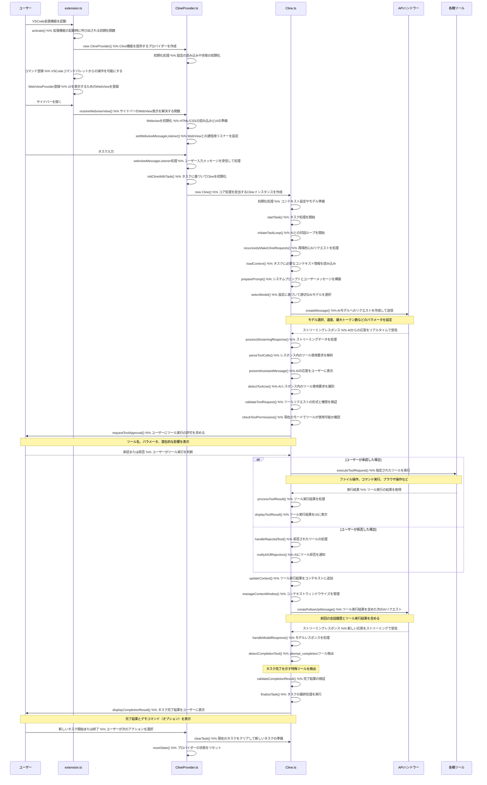

# Clineメイン処理フロー



## 主要コンポーネントの説明

### extension.ts
VSCode拡張機能のエントリーポイント。拡張機能の起動時に実行され、ClineProviderの初期化やコマンド登録を行います。

### ClineProvider.ts
Webviewの管理とユーザーインターフェースの処理を担当します。ユーザーからの入力を受け取り、Clineクラスに処理を委譲します。

### Cline.ts
コア処理ロジックとツール実行を担当します。APIリクエストの送信、レスポンスの処理、ツールの実行などを行います。

## 主要な処理フロー

1. **拡張機能の起動**：
   - VSCode拡張機能が起動すると、`extension.ts`の`activate()`関数が実行されます
   - `ClineProvider`のインスタンスが作成され、WebViewProviderとして登録されます

2. **サイドバー表示**：
   - ユーザーがサイドバーを開くと、`resolveWebviewView()`が呼び出されます
   - Webviewが初期化され、メッセージリスナーが設定されます

3. **タスク開始**：
   - ユーザーがタスクを入力すると、`webviewMessageListener`がメッセージを処理します
   - `initClineWithTask()`が呼び出され、`Cline`インスタンスが作成されます
   - `startTask()`が実行され、タスクループが開始されます

4. **APIリクエスト**：
   - `recursivelyMakeClineRequests()`が実行され、APIリクエストが送信されます
   - APIからのレスポンスがストリーミングで受信され、`presentAssistantMessage()`で処理されます

5. **ツール使用**：
   - レスポンス内でツール使用が検出されると、ユーザーに承認を求めます
   - 承認されると、対応するツールが実行され、結果がユーザーに表示されます
   - ツール実行結果を含めて次のAPIリクエストが送信されます

6. **タスク完了**：
   - `attempt_completion`ツールが検出されると、タスク完了と見なされます
   - 完了結果がユーザーに表示され、新しいタスクを開始するか終了するかを選択できます

## AIモデルとの連携

### AIモデルの選択と設定

Clineは複数のAIプロバイダーとモデルをサポートしています：

1. **サポートされるプロバイダー**：
   - Anthropic（Claude）
   - OpenAI（GPT-4、GPT-3.5）
   - Google（Gemini）
   - Mistral AI
   - その他のローカルモデルやサードパーティプロバイダー

2. **モデル選択メカニズム**：
   - ユーザー設定に基づいて自動的に選択
   - タスクの複雑さに応じて適切なモデルを選択
   - フォールバックメカニズムによる代替モデルの使用

3. **モデルパラメータ**：
   - 温度（Temperature）：創造性と決定論のバランスを制御
   - 最大トークン数：レスポンスの長さを制限
   - トップP/トップK：サンプリング方法の設定
   - 頻度ペナルティ：繰り返しを減らす設定

### プロンプトエンジニアリング

Clineは高度なプロンプトエンジニアリング技術を使用してAIの能力を最大化します：

1. **システムプロンプト構造**：
   - 役割定義：AIの専門知識と行動範囲を定義
   - ツール使用ガイドライン：利用可能なツールとその使用方法
   - 制約条件：AIの行動に関する制限事項
   - モード固有の指示：現在のモードに応じた特別な指示

2. **コンテキスト管理**：
   - スライディングウィンドウ：コンテキスト長の制限内で重要な情報を保持
   - 優先順位付け：タスク関連情報の重要度に基づく選択
   - メタデータ埋め込み：ファイル構造やシステム情報の効率的な提供

3. **カスタマイズ**：
   - ユーザー定義のカスタム指示：特定のプロジェクトやワークフローに合わせた調整
   - モードごとの最適化：コード、アーキテクト、質問応答などの特化したモード

### AIレスポンス処理

AIからのレスポンスは複数の段階で処理されます：

1. **ストリーミング処理**：
   - チャンク単位の受信：小さな部分ごとにレスポンスを受信
   - 増分表示：受信したチャンクをリアルタイムでUIに表示
   - マークダウンレンダリング：適切な書式でコンテンツを表示

2. **ツール使用検出**：
   - XMLパターン認識：ツール使用を示す特定のパターンを検出
   - パラメータ抽出：ツールに必要なパラメータを解析
   - 検証：ツールリクエストの形式と権限を検証

3. **エラー処理とリトライ**：
   - 接続エラー：ネットワーク問題の検出と再試行
   - モデルエラー：AIモデルからのエラーレスポンスの処理
   - コンテキスト長超過：コンテキスト長が制限を超えた場合の対応
   - レート制限：APIレート制限に達した場合のバックオフ戦略

### AIとのインタラクションループ

Clineは再帰的なインタラクションループを通じてタスクを進行します：

1. **初期リクエスト**：
   - ユーザータスクとシステムプロンプトを含む初期リクエスト
   - 環境情報（ファイル構造、システム情報など）の提供

2. **ツール使用サイクル**：
   - AIがツール使用を提案
   - ユーザーが承認または拒否
   - ツール実行結果をAIに返送
   - AIが結果を分析して次のステップを提案

3. **タスク完了**：
   - AIが`attempt_completion`ツールを使用してタスク完了を示す
   - 最終結果とデモコマンド（オプション）の提示
   - ユーザーフィードバックに基づく改善（必要に応じて）

4. **コンテキスト管理**：
   - 長期的なタスクでのコンテキスト管理
   - 重要な情報の保持と不要な情報の削除
   - トークン使用量の最適化

## 主要関数の詳細実装

### initiateTaskLoop() - AIとの対話ループを開始

この関数は、ユーザーのタスク入力からAIとの対話ループを開始する役割を担っています。

```typescript
private async initiateTaskLoop(userContent: UserContent, isNewTask: boolean): Promise<void> {
    let nextUserContent = userContent;
    let includeFileDetails = true;
    while (!this.abort) {
        const didEndLoop = await this.recursivelyMakeClineRequests(nextUserContent, includeFileDetails, isNewTask);
        includeFileDetails = false; // 最初のリクエストでのみファイル詳細を含める

        if (didEndLoop) {
            // タスクが完了した場合（attempt_completionが呼ばれた場合）、ループを抜ける
            break;
        } else {
            // AIがツールを使用せずにテキストのみで応答した場合、タスク継続を促す
            nextUserContent = [
                {
                    type: "text",
                    text: formatResponse.noToolsUsed(),
                }
            ];
            this.consecutiveMistakeCount++;
        }
    }
}
```

主な処理内容：
- ユーザーのタスク内容（userContent）を受け取り、AIとの対話ループを開始します
- 最初のリクエストでは環境情報（ファイル構造など）を含めます（includeFileDetails = true）
- `recursivelyMakeClineRequests()`を呼び出してAIリクエストを処理します
- AIがツールを使用せずにテキストのみで応答した場合、タスク継続を促すメッセージを送信します
- ユーザーがタスクをキャンセルするか、AIが`attempt_completion`ツールを使用するまでループを継続します
- 連続してツールを使用しない場合、consecutiveMistakeCountをインクリメントして、一定回数以上になると警告を表示します

### recursivelyMakeClineRequests() - 再帰的にAIリクエストを処理

この関数は、AIとのリクエスト・レスポンスサイクルを管理する中核的な関数です。

```typescript
async recursivelyMakeClineRequests(
    userContent: UserContent,
    includeFileDetails: boolean = false,
    isNewTask: boolean = false
): Promise<boolean> {
    // コンテキスト情報のロード
    const [parsedUserContent, environmentDetails] = await this.loadContext(userContent, includeFileDetails);
    userContent = parsedUserContent;
    userContent.push({ type: "text", text: environmentDetails });
    
    // APIリクエストの送信と応答の処理
    await this.addToApiConversationHistory({
        role: "user",
        content: userContent,
    });
    
    // APIストリームの初期化と処理
    const stream = this.attemptApiRequest(previousApiReqIndex);
    
    // ストリーミングレスポンスの処理
    for await (const chunk of stream) {
        // チャンクの処理（使用量、推論、テキスト）
        // アシスタントメッセージの解析とツール使用の検出
        // presentAssistantMessage()を呼び出してUIに表示
    }
    
    // アシスタントの応答をAPIの会話履歴に追加
    await this.addToApiConversationHistory({
        role: "assistant",
        content: [{ type: "text", text: assistantMessage }],
    });
    
    // ツール使用の有無を確認して次のステップを決定
    const didToolUse = this.assistantMessageContent.some((block) => block.type === "tool_use");
    
    if (!didToolUse) {
        // ツール使用がない場合、タスク継続を促す
        this.userMessageContent.push({
            type: "text",
            text: formatResponse.noToolsUsed(),
        });
        this.consecutiveMistakeCount++;
    }
    
    // 再帰的に次のリクエストを処理
    const recDidEndLoop = await this.recursivelyMakeClineRequests(this.userMessageContent);
    return recDidEndLoop;
}
```

主な処理内容：
- `loadContext()`を呼び出してユーザーコンテンツと環境情報を準備します
- APIリクエストを送信し、ストリーミングレスポンスを処理します
- レスポンスを解析してアシスタントメッセージとツール使用を検出します
- ツール使用があれば実行し、結果をユーザーに表示します
- ツール実行結果を含めて次のAPIリクエストを再帰的に処理します
- エラー処理、トークン使用量の追跡、会話履歴の管理なども行います
- 連続してエラーが発生した場合、ユーザーに通知して対応を求めます
- チェックポイント機能を使用して、タスクの状態を保存します

### loadContext() - タスクに必要なコンテキスト情報を読み込み

この関数は、AIに提供するコンテキスト情報を準備します。

```typescript
async loadContext(userContent: UserContent, includeFileDetails: boolean = false) {
    return await Promise.all([
        // ユーザーコンテンツ内のメンション（@ファイルパスなど）を解析
        Promise.all(
            userContent.map(async (block) => {
                if (block.type === "text") {
                    if (
                        block.text.includes("<feedback>") ||
                        block.text.includes("<answer>") ||
                        block.text.includes("<task>") ||
                        block.text.includes("<user_message>")
                    ) {
                        return {
                            ...block,
                            text: await parseMentions(block.text, cwd, this.urlContentFetcher),
                        }
                    }
                }
                return block;
            }),
        ),
        // 環境詳細情報の取得
        this.getEnvironmentDetails(includeFileDetails),
    ]);
}
```

主な処理内容：
- ユーザーコンテンツ内のメンション（@ファイルパスなど）を解析して実際のコンテンツに置き換えます
- `getEnvironmentDetails()`を呼び出して環境情報を取得します
  - VSCodeの表示ファイル、開いているタブ
  - アクティブなターミナル情報と出力
  - 現在の時刻とタイムゾーン
  - 現在の作業ディレクトリのファイル構造（includeFileDetails=trueの場合）
  - 現在のモード（PlanモードかActモード）の情報
- ユーザーが生成したコンテンツ（フィードバック、回答、タスク、メッセージ）を特定のタグで囲み、メンション解析の対象とします

### preparePrompt() - システムプロンプトとユーザーメッセージを構築

この関数は直接実装されていませんが、`recursivelyMakeClineRequests()`内で以下のようにプロンプトを構築しています：

```typescript
// システムプロンプトの構築
let systemPrompt = await SYSTEM_PROMPT(cwd, supportsComputerUse, mcpHub, this.browserSettings);

// カスタム指示、言語設定、.clinerules、.clineignoreなどの追加
if (
    settingsCustomInstructions ||
    clineRulesFileInstructions ||
    clineIgnoreInstructions ||
    preferredLanguageInstructions
) {
    systemPrompt += addUserInstructions(
        settingsCustomInstructions,
        clineRulesFileInstructions,
        clineIgnoreInstructions,
        preferredLanguageInstructions,
    );
}

// コンテキストウィンドウの管理（トークン数が多い場合に会話履歴を切り詰める）
if (previousApiReqIndex >= 0) {
    const previousRequest = this.clineMessages[previousApiReqIndex];
    if (previousRequest && previousRequest.text) {
        const { tokensIn, tokensOut, cacheWrites, cacheReads } = JSON.parse(previousRequest.text);
        const totalTokens = (tokensIn || 0) + (tokensOut || 0) + (cacheWrites || 0) + (cacheReads || 0);
        let contextWindow = this.api.getModel().info.contextWindow || 128_000;
        
        // コンテキストウィンドウサイズに基づいて会話履歴を切り詰める
        if (totalTokens >= maxAllowedSize) {
            this.conversationHistoryDeletedRange = getNextTruncationRange(
                this.apiConversationHistory,
                this.conversationHistoryDeletedRange,
                keep,
            );
        }
    }
}

// 切り詰められた会話履歴の取得
const truncatedConversationHistory = getTruncatedMessages(
    this.apiConversationHistory,
    this.conversationHistoryDeletedRange,
);

// APIリクエストの作成と送信
let stream = this.api.createMessage(systemPrompt, truncatedConversationHistory);
```

主な処理内容：
- システムプロンプトの構築（AIの役割、ツール使用ガイドライン、制約条件など）
- カスタム指示、言語設定、.clinerules、.clineignoreなどの追加
- コンテキストウィンドウの管理（トークン数が多い場合に会話履歴を切り詰める）
- モデルの特性に応じたコンテキストウィンドウサイズの調整
- 切り詰められた会話履歴を使用してAPIリクエストを作成
- 異なるAIモデル間での切り替えに対応するためのコンテキスト管理