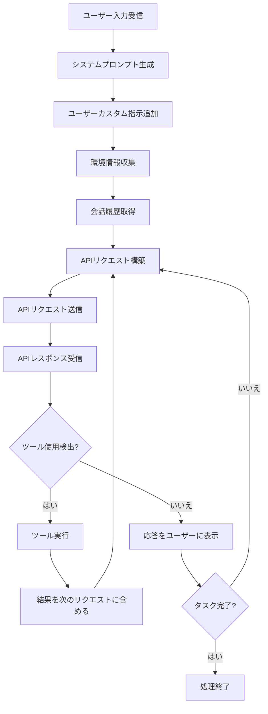
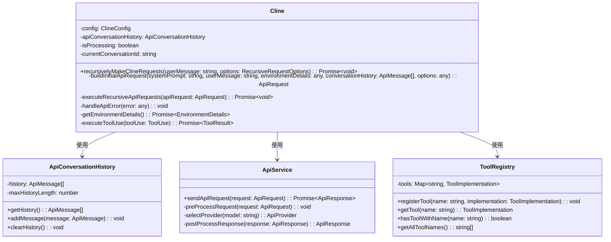
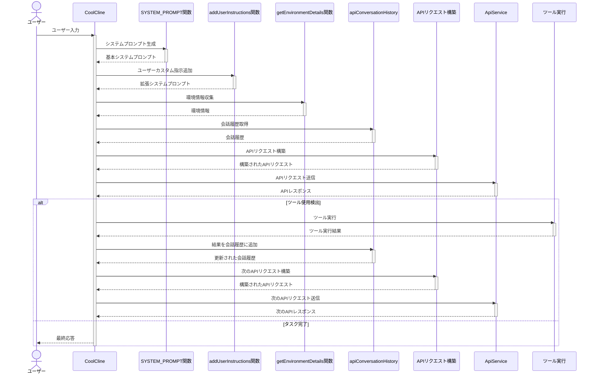
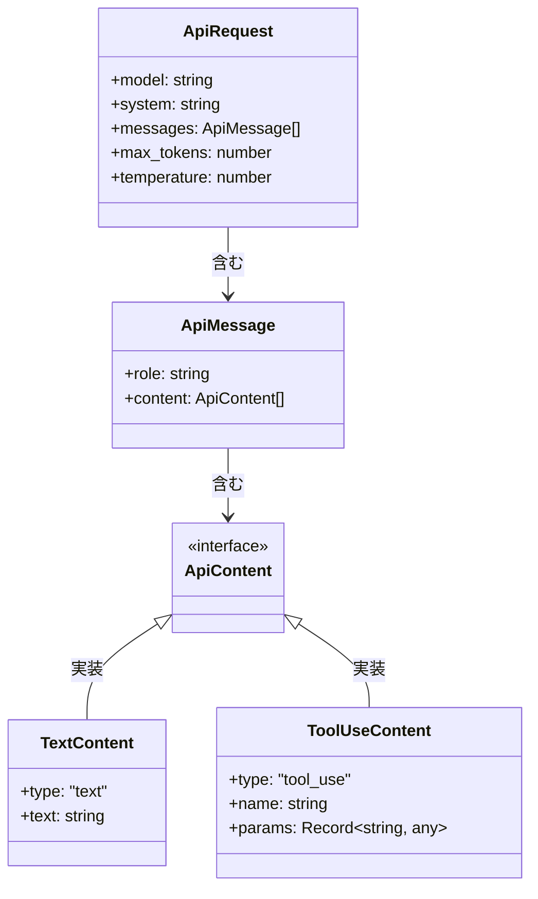
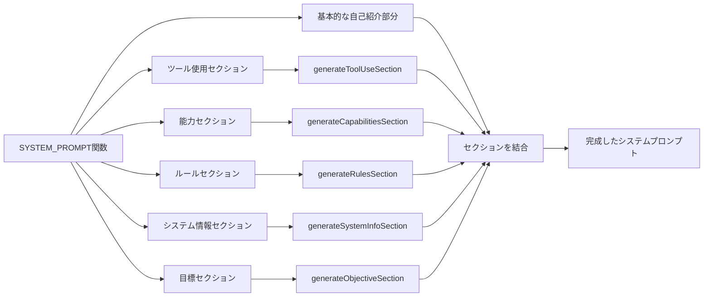
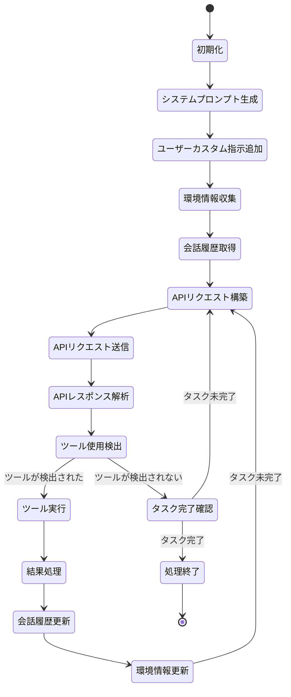
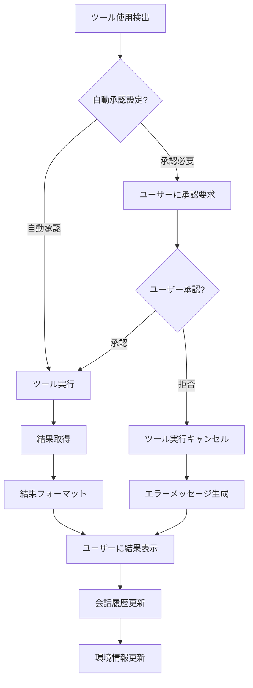
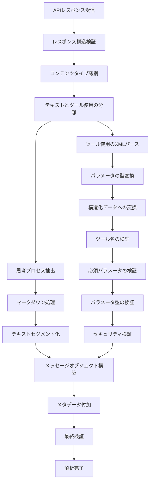
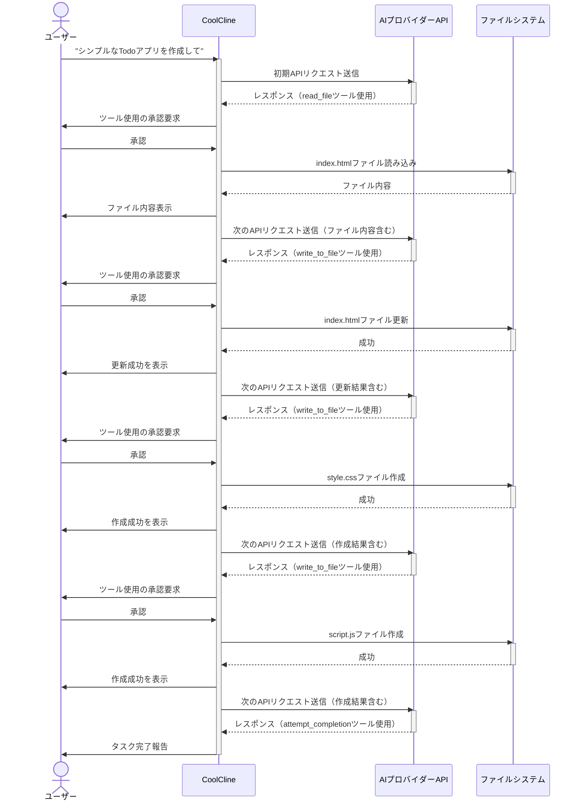

# システムプロンプトからAPIリクエストへの変換フロー

このドキュメントでは、CoolClineのシステムプロンプトがAPIリクエストに変換される基本的なフローをUML図（Mermaid記法）で説明します。

## 1. 全体的なフロー図

## 2. クラス図

## 3. シーケンス図

## 4. APIリクエスト構造

## 5. システムプロンプト生成プロセス

## 6. 再帰的なAPIリクエスト処理

## 7. ツール実行プロセス

## 8. APIレスポンス解析プロセス

## 9. 完全なループ例（Todoアプリ作成）

## 10. まとめ

CoolClineのシステムプロンプトからAPIリクエストへの変換プロセスは、複数のステップから構成される複雑なフローです。このプロセスは、静的なシステムプロンプトと動的な会話履歴・環境情報を組み合わせ、ユーザーの依頼に応じて適切なツールを使用し、タスクを効率的に実行する仕組みを提供しています。

上記のUML図は、このプロセスの主要なコンポーネントと相互作用を視覚的に表現したものです。システムプロンプトの生成から始まり、APIリクエストの構築、送信、レスポンスの解析、ツールの実行、そして次のリクエストへのフィードバックという一連のサイクルが、タスクが完了するまで繰り返されます。