# システムプロンプト、ツール、LLM APIの関係

このドキュメントでは、大規模言語モデル（LLM）を活用したアプリケーションにおける「システムプロンプト」「ツール」「LLM API」の関係性について説明します。

## 概念図

## コンポーネント間の関係図

## クラス図

```mermaid
classDiagram
    class SystemPrompt {
        +String roleDefinition
        +String capabilities
        +String toolGuidelines
        +String constraints
        +String modeInstructions
        +buildPrompt() String
        +addCustomInstructions(String) void
        +addLanguagePreference(String) void
        +addModeSpecificInstructions(String) void
    }
    
    class Tool {
        <<interface>>
        +String name
        +String description
        +Object parameters
        +validate() boolean
        +execute() Result
    }
    
    class FileOperationTool {
        +read_file(path) String
        +write_to_file(path, content) boolean
        +apply_diff(path, diff) boolean
        +search_files(path, regex) Result
        +list_files(path) Result
    }
    
    class CommandTool {
        +execute_command(command) Result
    }
    
    class BrowserTool {
        +launch(url) Screenshot
        +click(coordinates) Screenshot
        +type(text) void
        +scroll() Screenshot
        +close() void
    }
    
    class MCPTool {
        +use_mcp_tool(server, tool, args) Result
        +access_mcp_resource(server, uri) Resource
    }
    
    class InteractionTool {
        +ask_followup_question(question) Answer
        +attempt_completion(result) void
    }
    
    class LLMProvider {
        <<interface>>
        +String name
        +ModelInfo[] availableModels
        +selectModel(task) Model
        +createMessage(prompt, history) Stream
        +handleError(error) Strategy
    }
    
    class AnthropicProvider {
        +createMessage(prompt, history) Stream
    }
    
    class OpenAIProvider {
        +createMessage(prompt, history) Stream
    }
    
    class GeminiProvider {
        +createMessage(prompt, history) Stream
    }
    
    class MistralProvider {
        +createMessage(prompt, history) Stream
    }
    
    Tool <|-- FileOperationTool
    Tool <|-- CommandTool
    Tool <|-- BrowserTool
    Tool <|-- MCPTool
    Tool <|-- InteractionTool
    
    LLMProvider <|-- AnthropicProvider
    LLMProvider <|-- OpenAIProvider
    LLMProvider <|-- GeminiProvider
    LLMProvider <|-- MistralProvider
```

## 主要コンポーネントの説明

### システムプロンプト

システムプロンプトは、LLMに対して「どのように振る舞うべきか」を指示する重要な要素です。以下の要素で構成されています：

1. **役割定義**：
   - AIの専門知識と行動範囲を定義
   - 例：「あなたはCoolCline、多くのプログラミング言語、フレームワーク、デザインパターン、ベストプラクティスに関する広範な知識を持つ高度なスキルを持つソフトウェアエンジニアです」

2. **ツール使用ガイドライン**：
   - 利用可能なツールとその使用方法の説明
   - ツール使用の形式（XMLタグ形式など）
   - パラメータの説明と例
   - ツール使用の制約条件

3. **制約条件**：
   - AIの行動に関する制限事項
   - ファイルアクセス権限
   - コマンド実行の制限
   - 応答形式のルール

4. **モード固有の指示**：
   - 現在のモード（コード、アーキテクト、質問応答など）に応じた特別な指示
   - モードごとの権限と制約

5. **カスタマイズ要素**：
   - ユーザー定義のカスタム指示
   - 言語設定
   - プロジェクト固有のルール

### ツール

ツールは、AIが外部世界と相互作用するための機能を提供します。主なツールカテゴリ：

1. **ファイル操作ツール**：
   - `read_file`：ファイルの内容を読み取る
   - `write_to_file`：ファイルに内容を書き込む
   - `apply_diff`：既存ファイルに差分を適用する
   - `search_files`：ファイル内を検索する
   - `list_files`：ディレクトリ内のファイルを一覧表示する
   - `list_code_definition_names`：コード定義名を一覧表示する

2. **コマンド実行ツール**：
   - `execute_command`：システムコマンドを実行する

3. **ブラウザ操作ツール**：
   - `browser_action`：ブラウザを制御して操作する
   - アクション：launch、click、type、scroll_down、scroll_up、close

4. **MCP連携ツール**：
   - `use_mcp_tool`：MCPサーバーが提供するツールを使用する
   - `access_mcp_resource`：MCPサーバーが提供するリソースにアクセスする

5. **インタラクションツール**：
   - `ask_followup_question`：ユーザーに追加情報を求める
   - `attempt_completion`：タスク完了を示す

### LLM API

LLM APIは、AIモデルとの通信を担当します：

1. **モデル選択**：
   - ユーザー設定に基づいて自動的に選択
   - タスクの複雑さに応じて適切なモデルを選択
   - フォールバックメカニズムによる代替モデルの使用

2. **モデルパラメータ**：
   - 温度（Temperature）：創造性と決定論のバランスを制御
   - 最大トークン数：レスポンスの長さを制限
   - トップP/トップK：サンプリング方法の設定
   - 頻度ペナルティ：繰り返しを減らす設定

3. **リクエスト処理**：
   - システムプロンプトとユーザーメッセージの送信
   - ストリーミングレスポンスの受信と処理
   - エラー処理とリトライ戦略

4. **プロバイダー**：
   - Anthropic（Claude）
   - OpenAI（GPT-4、GPT-3.5）
   - Google（Gemini）
   - Mistral AI
   - その他のローカルモデルやサードパーティプロバイダー

## 処理フロー詳細

### 1. タスク開始時の処理

1. ユーザーがタスクを入力
2. アプリケーションがコンテキスト情報を収集
   - 環境情報（VSCode表示ファイル、開いているタブなど）
   - ファイル構造
   - メンション解析（@ファイルパスなど）
3. システムプロンプトを構築
   - 基本システムプロンプト
   - カスタム指示
   - 言語設定
   - モード固有の指示
4. 適切なAIモデルを選択
5. APIリクエストを送信

### 2. ツール使用サイクル

1. AIがレスポンスを生成し、ツール使用を提案
2. アプリケーションがツール使用要求を検出
3. ユーザーにツール実行の承認を求める
4. ユーザーが承認した場合：
   - ツールを実行
   - 実行結果をAIに返送
5. ユーザーが拒否した場合：
   - 拒否情報をAIに通知
6. AIが新しいレスポンスを生成
7. 必要に応じてサイクルを繰り返す

### 3. タスク完了

1. AIが`attempt_completion`ツールを使用してタスク完了を示す
2. アプリケーションがタスク完了を検出
3. 最終結果をユーザーに表示
4. オプションでデモコマンドを実行

## システムプロンプトとツールの連携

システムプロンプトとツールは密接に連携しています：

1. **ツール定義**：
   - システムプロンプト内でツールの名前、説明、パラメータ、使用例を定義
   - ツールの使用形式（XMLタグ形式など）を指定

2. **ツール使用ガイドライン**：
   - ツールの適切な使用方法を指示
   - 一度に一つのツールを使用するなどの制約
   - ユーザー承認の必要性

3. **ツール実行フロー**：
   - AIがツール使用を提案
   - アプリケーションがツール使用要求を検出
   - ユーザーが承認
   - ツールが実行され、結果がAIに返送

4. **ツール権限管理**：
   - モードごとに使用可能なツールを制限
   - ファイルアクセス権限の管理
   - コマンド実行の制限

## ツールとLLM APIの連携

ツールとLLM APIも密接に連携しています：

1. **ツール使用検出**：
   - AIレスポンス内のツール使用要求を検出
   - XMLパターン認識などの技術を使用

2. **ツール実行結果の送信**：
   - ツール実行結果をAIに送信
   - 結果をコンテキストに追加

3. **コンテキスト管理**：
   - ツール実行結果を含めたコンテキスト管理
   - トークン使用量の最適化

4. **エラー処理**：
   - ツール実行エラーの処理
   - AIへのエラー通知

## システムプロンプトとLLM APIの連携

システムプロンプトとLLM APIも密接に連携しています：

1. **プロンプト構築**：
   - システムプロンプトの構築
   - ユーザーメッセージの追加
   - コンテキスト情報の追加

2. **モデル選択**：
   - タスクの複雑さに応じたモデル選択
   - システムプロンプトの長さに基づくモデル選択

3. **コンテキスト管理**：
   - システムプロンプトを含めたコンテキスト管理
   - トークン使用量の最適化

4. **エラー処理**：
   - コンテキスト長超過の処理
   - モデルエラーの処理

## まとめ

システムプロンプト、ツール、LLM APIは、AIを活用したアプリケーションの中核をなす3つの要素です。これらが連携することで、AIは単なるテキスト生成を超えて、実際の作業を行うことができます。

1. **システムプロンプト**は、AIの行動指針を定義します。
2. **ツール**は、AIが外部世界と相互作用する能力を提供します。
3. **LLM API**は、AIモデルとの通信を担当します。

これらの要素が適切に連携することで、AIは複雑なタスクを段階的に実行し、ユーザーの目標を達成することができます。